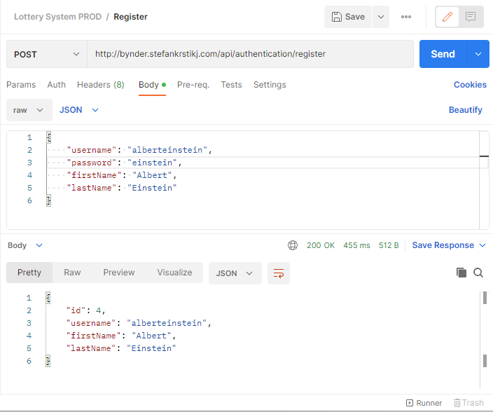
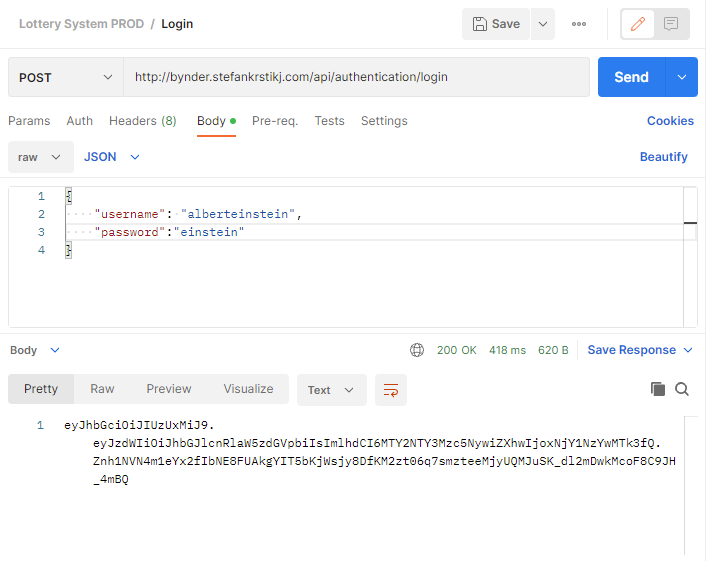
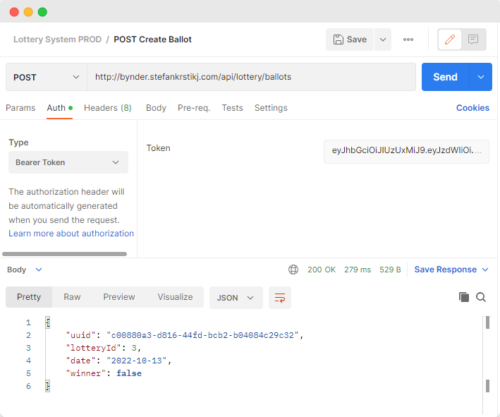
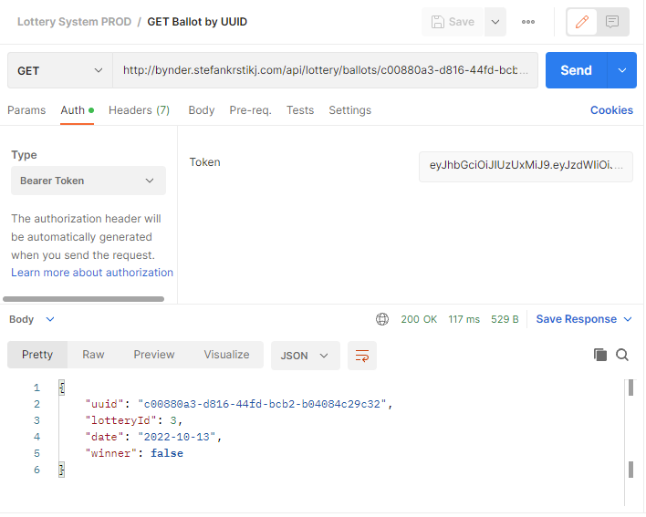
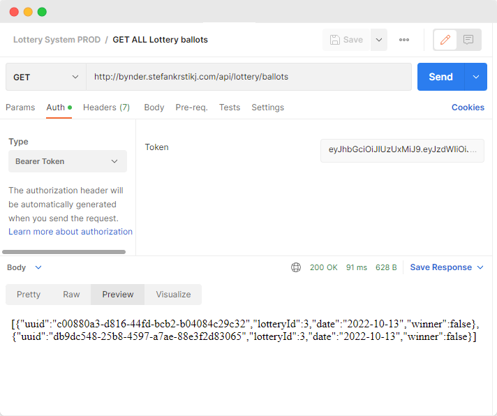
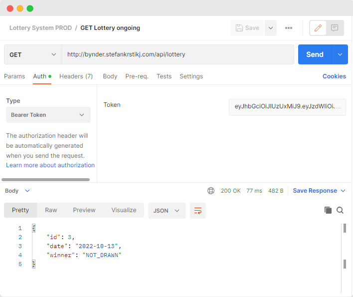
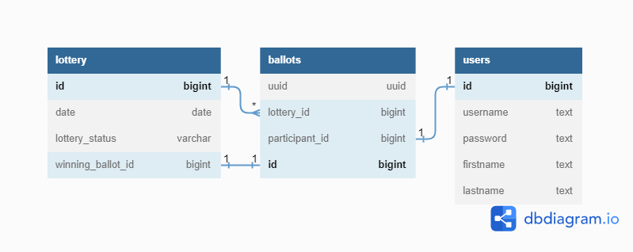

# Lottery System

---
A web API built in Spring Boot for a lottery system.

There is a lottery that runs every day. At exactly 00:00:01, a winner is drawn from the ongoing lottery and a new
lottery is started. Any person can submit ballots for the lottery, as long as they are registered and authenticated in
the system.

Any registered participant can:

- Create a ballot for the current ongoing lottery
- Get a list of all of their current active ballots
- Check if any ballot is a winning ballot
- Get information for the current and for any historic lotteries

The application is up and running on **[bynder.stefankrstikj.com]()**, so feel free to test the API in a live
environment. The API Documentation is available at **[bynder.stefankrstikj.com/swagger-ui.html]()**, and explained
further in detail below

### 📒 Contents:

- [Getting started](#getting-started)
    - [Set up the database](#set-up-the-database)
    - [Start up the project](#start-up-the-project)
- [API Documentation](#api-documentation)
    - [Authentication Controller](#authentication-controller)
    - [Lottery Ballot Controller](#lotteryballot-controller)
    - [Lottery Controller](#lottery-controller)
- [UML Diagram](#uml-diagram)
- [Libraries and tools used](#libraries-and-tools-used)
- [What I'm proud of](#what-im-particularly-proud-of)

## 🏃Getting started

---

### Requirements

- Java 11
- [PostgreSQL](https://www.postgresql.org/download/)
- Terminal or IDE of your choice

### Set up the database

> **Warning:**
> It is highly recommended replacing '**lotterysystem**' with your own username and password for security

Create a new database and user in postgres. Start the postgreSQL CLI by typing `psql` in your terminal and enter the
following.

```
create database lotterysystem;
create user lotterysystem with encrypted password 'lotterysystem';
grant all privileges on database lotterysystem to lotterysystem;
```

Open `application-dev.yml` and edit the following if needed

```
url: jdbc:postgresql://localhost:5432/lotterysystem
username: lotterysystem
password: lotterysystem
```

### Start up the project

Start the application in your favorite IDE by running `LotterySystemApplication.class`
or by running `./gradlew bootRun` in the terminal while in the root of the project

## 📄 API Documentation & Examples

---

The Swagger API Documentation is available at [bynder.stefankrstikj.com/swagger-ui.html]() or locally
at `localhost:8085/swagger-ui.html` once the application has been started

### Authentication Controller

#### Register

Anyone can register as a user, aka a lottery participant by providing a `username`, `password`, `firstname`
and `lastname`

```
Endpoint: api/authentication/register

Method: POST
```



#### Login

Logging in using the username and password returns a JWT Bearer Token, which is needed for all the other secured,
lottery-related endpoints. This token needs to be used in the Authorization header.

```
Endpoint: api/authentication/login

Method: POST
```



### LotteryBallot Controller

#### Create a ballot

A simple empty body request to this endpoint will create a new ballot for the ongoing lottery for the current logged-in
user. The information is extracted from the JWT Token provided in the Authorization header

```
Endpoint: api/lottery/ballots

Method: POST
```



#### Get ballot by UUID

Returns a ballot by the provided UUID

```
Endpoint: api/lottery/ballots/{uuid}

Method: GET
```



#### Get all active ballots

Returns a list of all the ballots for the current user

```
Endpoint: api/lottery/ballots

Method: GET
```



### Lottery Controller

#### Get ongoing lottery

Returns the current ongoing lottery

```
Endpoint: api/lottery

Method: GET
```



#### Get lottery for date

Returns a lottery for a given historic date, or else throws an exception

```
Endpoint: api/lottery/{date}

Method: GET
```

TODO Add an image

## 🔁 UML Diagram

---
We have a pretty simple database relation.

- `users` holds the information for all the registered users (lottery participants), with their first name, last name,
  and encrypted password.
- `lottery` stores everything related to the lottery that runs every day. Here we need the `date` of the lottery,
  the `lottery_status` (OPEN, CLOSED) and the `winning_ballot_id`
- `ballots` has all the ballots that the users submit. We have a column **uuid** which is used as a unique identifier
  for the ballots, rather than an incremental `id`. This is so that the users have no knowledge of the amount of ballots
  submitted, as this can be advantageous to them



## 📚 Libraries and tools used

---

- **Spring Boot** - Helps us quickly get started with building applications on the Spring framework.
- **Spring Data JPA** - Used for implementing JPA based repositories and accessing the data layer.
- **Spring Security** - An authentication and access-control framework
- **PostgreSQL** - Our database of choice
- **Gradle** - Build automation tool
- **Lombok** - Java library that helps us write cleaner and quicker code through smart annotations
- **Flyway Database Migration** - Used for automatic managing of our data
- **Amazon Web Services (AWS)** - Used for hosting the API on [bynder.stefankrstikj.com]()
- **dbdiagram** - For the UML diagram above 🙂

## ⭐ What I'm particularly proud of

---

I am very proud of completing this project in a short amount of time, while also maintaining what I consider to be a
high quality of code. I managed to set up a new Spring Boot application which is live and working on
bynder.stefankrstikj.com. The API is well documented, relatively easy to understand, well tested and is open for further
development.

What I am **particularly proud of** is setting the project on AWS. Prior to this, I had some experience with AWS,
specifically in running EC2 instances which I used for other personal projects, such as hosting my
own [Nextcloud](https://github.com/nextcloud), and creating my own LDAP and Mail servers. For this project, I used
Elastic Beanstalk, which uses both EC2 instance(s) and RDS database to run a jar file that I build and upload manually.
Setting up the database part was a bit challenging as I had issues creating and connecting the application's database
and schema.

Ultimately, I am satisfied with my work, but there are still things to improve. You can read about them in
the [future imrpovements](#-future-improvements) section

## 🔮 Future improvements

---

- There is currently no front-end interface. A simple one can be created using thymeleaf, or a better one could be
  created using a front-end framework such as Angular or React
- Our `users` table does not store emails. There is no way to send a reset password email, or to even notify
  participants of their winning ballot
- Although the requirements mention a single lottery running per day, the application needs minor improvements to
  support multiple simultaneous lotteries
- I am not satisfied with the approach of having a Managing service that is the parent of Lottery and Lottery Ballot
  service. This was done to avoid potential circular dependency problems among LotteryService and LotteryBallotService.
  However, there is no consistency in terms of where our domain objects are mapped to DTOs for the response. I think a
  better approach would have been to have the mapping logic between the controller and services, and the managing
  service would be unneeded
- There is no limit on how many ballots a user can submit, so anyone would be able to win any lottery with a high
  probability easily with a script
- I am not completely happy with the way our scheduler runs at 00:00:01. There should be a better, more error-proof way
  to draw the winners for the lotteries
