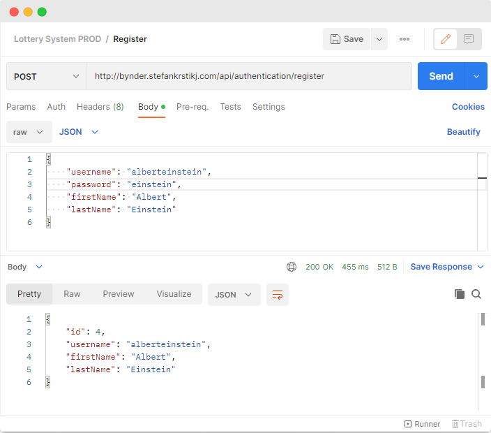
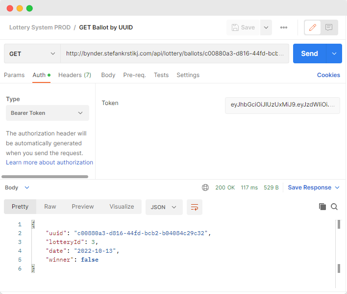

# Lottery System

A web API built in Spring Boot for a lottery system.

There is a lottery that runs every day. At exactly 00:00:01, a winner is drawn from the ongoing lottery and a new
lottery is started. Any person can submit ballots for the lottery, as long as they are registered and authenticated in
the system.

Any registered participant can:

- Create a ballot for the current ongoing lottery
- Get a list of all of their current active ballots
- Check if any ballot is a winning ballot
- Get information for the current and for any historic lotteries

The application is up and running on **[bynder.stefankrstikj.com]()**, so feel free to test the API in a live
environment. The API Documentation is available at **[bynder.stefankrstikj.com/swagger-ui.html]()**, and explained
further in detail below

## How to build/run your application

**Requirements**

- Java 11
- [PostgreSQL](https://www.postgresql.org/download/)

### Set up the database

1. Create a new database and user in postgres. Start the postgreSQL CLI by typing `psql` in your terminal and enter the
   following.

**_(Note)_** It is recommended to replace '**lotterysystem**' with your own username and password

```
create database lotterysystem;
create user lotterysystem with encrypted password 'lotterysystem';
grant all privileges on database lotterysystem to lotterysystem;

```

2. _(If you used your custom username and password)_

Open `application-dev.yml` and edit the following, replacing '**lotterysystem**' with the previously created user's
username and password

```
url: jdbc:postgresql://localhost:5432/lotterysystem
username: lotterysystem
password: lotterysystem
```

### Start up the project

Start the application in your favorite IDE by running `LotterySystemApplication.class`
or by running `./gradlew bootRun` in the terminal while in the root of the project

## API Documentation

The Swagger API Documentation is available at [bynder.stefankrstikj.com/swagger-ui.html]() or locally
at `localhost:8085/swagger-ui.html` once the application has been started

### Authentication Controller

#### Register

Endpoint: **api/authentication/register**

Method: **POST**

Anyone can register as a user, aka a lottery participant by providing a `username`, `password`, `firstname`
and `lastname`



#### Login

Endpoint: **api/authentication/login**
Method: **POST**

Logging in using the username and password returns a JWT Bearer Token, which is needed for all the other secured,
lottery-related endpoints. This token needs to be used in the Authorization header.


### LotteryBallot Controller

#### Create a ballot

Endpoint: **api/lottery/ballots**

Method: **POST**

A simple empty body request to this endpoint will create a new ballot for the ongoing lottery for the current logged-in
user. The information is extracted from the JWT Token provided in the Authorization header


#### Get ballot by UUID

Endpoint: **api/lottery/ballots/{uuid}**

Method: **GET**

Returns a ballot by the provided UUID



#### Get all active ballots

Endpoint: **api/lottery/ballots**

Method: **GET**

Returns a list of all the ballots for the current user


### Lottery

#### Get ongoing lottery

Endpoint: **api/lottery**

Method: **GET**

Returns the current ongoing lottery


#### Get lottery for date

Endpoint: **api/lottery/{date}**

Method: **GET**

Returns a lottery for a given historic date, or else throws an exception

TODO Add an image

## UML Diagram

We have a pretty simple database relation.

- `users` holds the information for all the registered users (lottery participants), with their first name, last name,
  and encrypted password.
- `lottery` stores everything related to the lottery that runs every day. Here we need the `date` of the lottery,
  the `lottery_status` (OPEN, CLOSED) and the `winning_ballot_id`
- `ballots` has all the ballots that the users submit. We have a column **uuid** which is used as a unique identifier
  for the ballots, rather than an incremental `id`. This is so that the users have no knowledge of the amount of ballots
  submitted, as this can be advantageous to them


## Libraries and tools used

- **Spring Boot** - Helps us quickly get started with building applications on the Spring framework.
- **Spring Data JPA** - Used for implementing JPA based repositories and accessing the data layer.
- **Spring Security** - An authentication and access-control framework
- **PostgreSQL** - Our database of choice
- **Gradle** - Build automation tool
- **Lombok** - Java library that helps us write cleaner and quicker code through smart annotations
- **Flyway Database Migration** - Used for automatic managing of our data
- **Amazon Web Services (AWS)** - Used for hosting the API on [bynder.stefankrstikj.com]()
- **dbdiagram** - For the UML diagram above 🙂

## What I'm particularly proud of


